## Andorid Framework入门

#### 第1章 系统服务相关问题
本章重点讲解系统核心进程，以及一些关键的系统服务的启动原理和工作原理相关的内容。
##### 1：谈谈对zygote的理解
Zygote的作用是什么？
对于Zygote的作用实际上可以概括为以下两点：
+ 创建SystemServer
+ 孵化应用进程

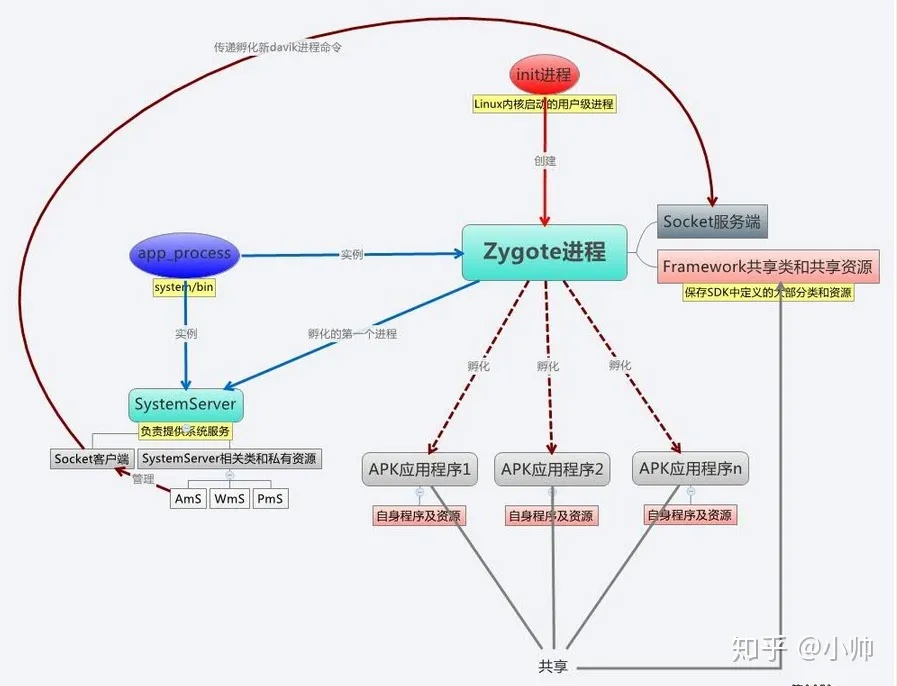 

+ 参考[谈谈对Android中Zygote的理解](https://zhuanlan.zhihu.com/p/260414370)
 

##### 2: 说说Android系统的启动
Android是基于Linux系统的。但是它没有BIOS程序，取而代之的是**BootLoader（系统启动加载器）**。类似于BIOS，在系统加载前，用于初始化硬件设备，最终调用系统内核准备好环境。在Android中没有硬盘，而是ROM，类似于硬盘存放操作系统，用户程序等。

ROM跟硬盘一样也会划分为不同的区域，用于放置不同的程序，在Android中主要划分为以下几个区域：
+ /boot: 存放引导程序，包括内核和内存操作程序
+ /system：相当于电脑C盘，存放Android系统和系统应用
+ /recover: 回复分区。可以进入该分区进行系统回复
+ /data: 用户数据区，包含了用户的数据：联系人、短信、设置、用户安装的程序
+ /cache: 安卓系统缓存区，保存系统经常访问的数据和应用程序
+ /misc: 杂项内容
+ /sdcard: 用户自己的存储区域。存放照片视频等
Android系统启动跟PC相似。当开机时，首先加载BootLoader，BootLoader会读取ROM找到系统并将内核加载进RAM中。

当内核启动后会初始化各种软硬件环境，加载驱动程序，挂载跟文件系统。最后阶段会启动执行第一个用户空间进程init进程。
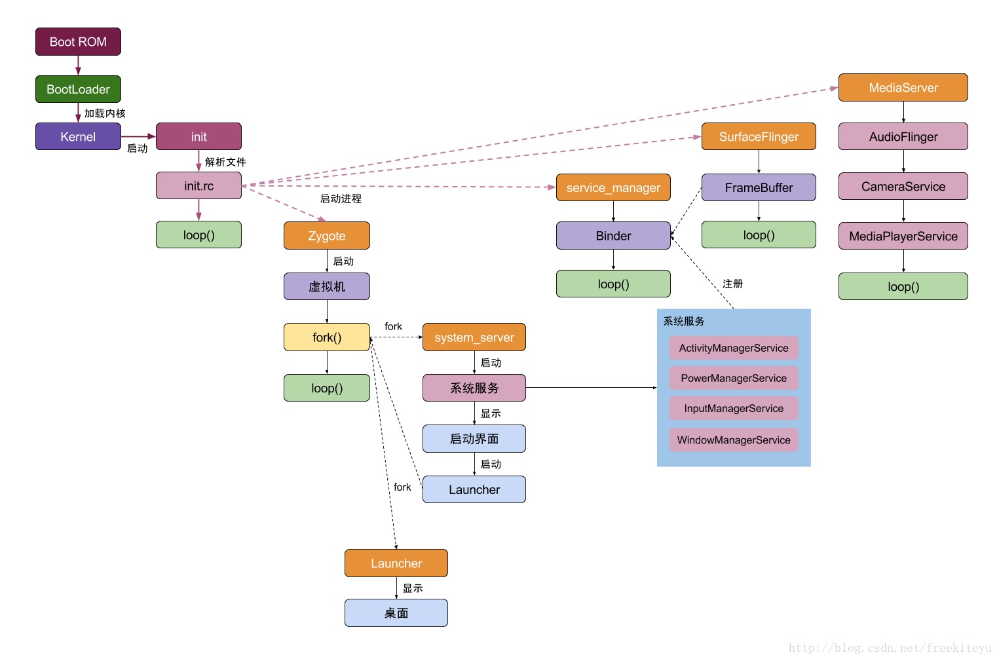

+  参考资料[《详解Android系统启动过程》](http://www.ay1.cc/article/18368.html)

##### 3 你知道怎么添加一个系统服务吗？
###### 新增的服务
+ 服务AIDL文件，定义服务的接口：
    ```shell
    frameworks/base/core/java/android/app/IDemoManager.aidl
    ```
+ 服务管理类，提供给客户端调用，以访问服务端的接口 (即持有服务端的引用， Binder 引用)
    ```shell
    frameworks/base/core/java/android/app/DemoManager.java
    ```
+ 服务实现类， 实现AIDL文件
    ```shell
    frameworks/base/services/core/java/com/android/server/DemoManagerService.java
    ```

###### 创建及启动服务涉及的修改
+ 定义服务的标识
    ```shell
    frameworks/base/core/java/android/content/Context.java
    ```
+ 创建及启动服务
    ```shell
    frameworks/base/services/java/com/android/server/SystemServer.java
    ```
+ 创建服务管理类(可同时获取服务端的代理对象，由服务管理对象持有)
    ```shell
    frameworks/base/core/java/android/app/SystemServiceRegistry.java
    ```
+ 参考[《Framework添加新的系统服务》](https://www.jianshu.com/p/74971ee85a8b)

#### 4 系统服务和bind的应用服务有什么区别？
##### 启动方式
+ 系统服务
  在SystemServer里面进行分批、分阶段启动，大部分都跑在binder线程里面。
##### 注册方式
+ 系统服务
  有系统服务才能注册在ServiceManager
+ 应用服务
  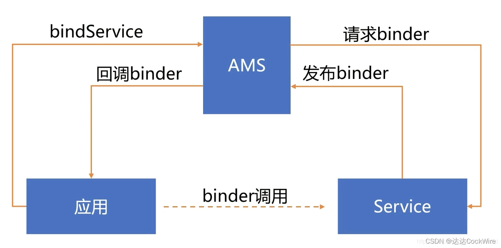
    + 应用端会向AMS发起bindService。
    + AMS会先判断这个Service是否已经注册过了，注册过就直接把之前发布的binder返回给应用；如果没有，AMS会像Service请求binder对象。（AMS请求的，属于被动注册）
    + Service会相应AMS的请求，发布这个binder对象到AMS
    + AMS再把这个binder对象回调给应用

##### 使用方式
+ 系统服务
  通过服务名去找到对于的ServiceFetcher对象，然后先通过SM.getService拿到binder对象，然后封装了一层拿到服务的管理对象。
+ 应用服务
  通过bindService向AMS发送绑定服务端请求，AMS通过onServiceConnected()回调把服务的binder对象返回给业务端，然后把这个对象封装成业务接口对象给业务接口调用。

#### 5 ServiceManager启动和工作原理是怎样的？
ServiceManager 是为了完成 Binder Server 的 Name（域名）和 Handle（IP 地址）之间对应关系的查询而存在的，它主要包含的功能：

+ 注册：当一个 Binder Server 创建后，应该将这个 Server 的 Name 和 Handle 对应关系记录到 ServiceManager 中
+ 查询：其他应用可以根据 Server 的 Name 查询到对应的 Service Handle
```shell    
binder 驱动 -> 路由器
ServiceManager -> DNS
Binder Client -> 客户端
Binder Server -> 服务器
```

+ 参考资料[《ServiceManager 的工作原理》](https://zhuanlan.zhihu.com/p/158623349)

#### 6 谈谈对AMS的理解
AMS即ActivityManagerService，AMS是Android中最核心的服务，主要负责系统中四大组件的启动、切换、调度及应用进程的管理和调度等工作，其职责与操作系统中的进程管理和调度模块相类似
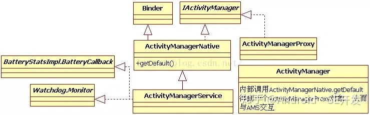

  + AMS的main函数：创建AMS实例，其中最重要的工作是创建Android运行环境，得到一个ActivityThread和一个Context对象。
  + AMS的setSystemProcess函数：该函数注册AMS和meminfo等服务到ServiceManager中。另外，它为SystemServer创建了一个ProcessRecord对象。由于AMS是Java世界的进程管理及调度中心，要做到对Java进程一视同仁，尽管SystemServer贵为系统进程，此时也不得不将其并入AMS的管理范围内。
  + AMS的installSystemProviders：为SystemServer加载SettingsProvider。
  + AMS的systemReady：做系统启动完毕前最后一些扫尾工作。该函数调用完毕后，HomeActivity将呈现在用户面前。 

+ 参考资料[《AMS在Android起到什么作用?》](https://zhuanlan.zhihu.com/p/86266649)
  
#### 第2章 应用进程相关问题

本章主要讲解应用进程的启动，以及伴随进程启动过程中的一些重要机制的初始化原理，比如binder机制，Application，以及Context等方面的问题。
##### 1 Android应用进程是怎么启动的吗？
###### 冷启动与热启动
Activity启动过程中，一般会牵涉到应用启动的流程。应用启动又分为冷启动和热启动。
+ 冷启动：点击桌面图标，手机系统不存在该应用进程，这时系统会重新fork一个子进程来加载Application并启动Activity，这个启动方式就是冷启动。
+ 热启动：应用的热启动比冷启动简单得多，开销也更低。在热启动中，因为系统里已有该应用的进程，所以系统的所有工作就是将您的 Activity 带到前台。 冷启动是应用完全从0开始启动，涉及到更多的内容，所以就应用冷启动的过程展开讨论。

###### 应用启动流程(冷启动)
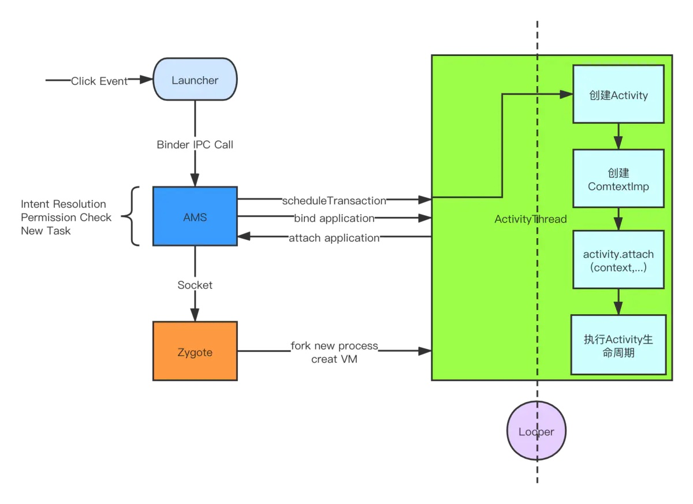
+ 启动进程 
  + 点击图标发生在Launcher应用的进程，startActivity()函数最终是由Instrumentation通过Android的Binder跨进程通信机制 发送消息给 system_server 进程； 
  + 在 system_server 中，启动进程的操作由ActivityManagerService 通过 socket 通信告知 Zygote 进程 fork 子进程（app进程）
+ 开启主线程 app 进程启动后，首先是实例化 ActivityThread，并执行其main()函数：创建 ApplicationThread，Looper，Handler 对象，并开启主线程消息循环Looper.loop()。
+ 创建并初始化 Application和Activity ActivityThread的main()调用 ActivityThread#attach(false)方法进行 Binder 通信，通知system_server进程执行 ActivityManagerService#attachApplication(mAppThread)方法，用于初始化Application和Activity。 
  + 在system_server进程中，ActivityManagerService#attachApplication(mAppThread)里依次初始化了Application和Activity，分别有2个关键函数： 
    + thread#bindApplication()方法通知主线程Handler 创建 Application 对象、绑定 Context 、执行 Application#onCreate() 生命周期 
    + mStackSupervisor#attachApplicationLocked()方法中调用 ActivityThread#ApplicationThread#scheduleLaunchActivity()方法，进而通过主线程Handler消息通知创建 Activity 对象，然后再调用 mInstrumentation#callActivityOnCreate()执行 Activity#onCreate() 生命周期
+ 布局&绘制 源码流程可以参考Android View 的绘制流程分析及其源码调用追踪

###### 参考资料
  + [《Android应用启动流程分析》](https://zhuanlan.zhihu.com/p/596546019)
  + [《Android应用进程的创建 — Activity的启动流程》](https://www.jianshu.com/p/0875116e2e54)

##### 2 应用是怎么启用Binder机制的


##### 3 谈谈对Application的理解
Application的作用
+ 保存应用进程中的全局变量
  Application会横跨进程的生命周期，我们可以在Application中维护一些全局变量
+ 应用初始化操作
  Application的创建是排在四大组件的前面
+ 提供应用的上下文
  Application可以提供一个稳定的context，而且因为Application的生命周期横跨整个应用的生命周期，所以不需要担心Application的context内存泄漏的问题
  
##### 4 谈谈对Context的理解
Context的字面含义是上下文环境。应用的上层代码通过Context类提供的接口来操作Android的4大组件和资源。在Android的应用程序中，Context无处不在，很多接口都要求用Context对象作为参数。
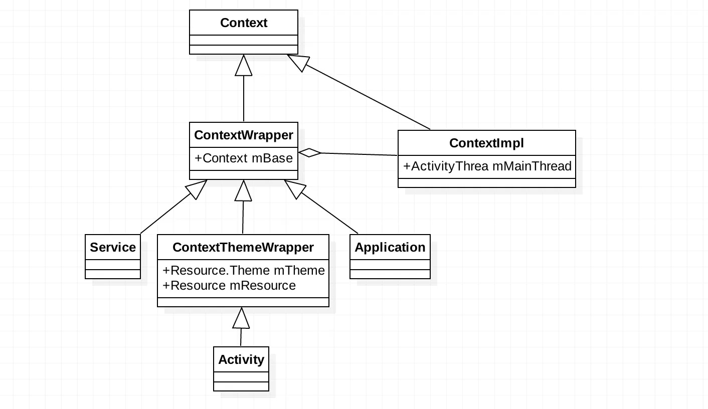

+ Application的Context和Activity的Context的区别？
Activity、Service和Application这三种类型的Context都是可以通用的


+ 如何获取Context？
通常我们想要获取Context对象，主要有以下四种方法
  + View.getContext
  返回当前View对象的Context对象，通常是当前正在展示的Activity对象。
  + Activity.getApplicationContext
  获取当前Activity所在的(应用)进程的Context对象，通常我们使用Context对象时，要优先考虑这个全局的进程Context。
  + ContextWrapper.getBaseContext()
  用来获取一个ContextWrapper进行装饰之前的Context，可以使用这个方法，这个方法在实际开发中使用并不多，也不建议使用。
  + Activity.this
  返回当前的Activity实例，如果是UI控件需要使用Activity作为Context对象，但是默认的Toast实际上使用ApplicationContext也可以。
  + getApplication()和getApplicationContext()
  它们得到的是同一个对象。getApplication()只能在Activity和Service中得到。在BroadcastReciver必须使用getApplicationContext()。
###### 参考资料
+ [《如何理解Context?》](https://zhuanlan.zhihu.com/p/27163977)

#### 第3章 Activity组件相关问题

这一章主要讲解Activity相关的机制，包括Activity的启动流程，显示原理等相关问题，通过本章的学习，我们不但能熟悉它，更能深入了解它。
##### 1 说说Activity的启动流程
##### 2 说说Activity的显示原理
##### 3 应用的UI线程是怎么启动的

#### 第4章 其它应用组件相关问题

本章主要讲除了Activity之外的应用组件相关问题，包括service的启动和绑定原理，静态广播和动态广播的注册和收发原理，provider的启动和数据传输原理等等。
##### 1 说说service的启动原理
Service的启动方式主要是：startService、bindService。
+ binderService和startService的区别：
  binderService不会触发应用端的onStartCommand函数。
###### startService的流程
流程分为两部分：AMS端、应用端。
+ AMS的流程：
  + 1). 先看Service启动了没有：如果启动了就直接发指令，让应用端执行onStartCommand()。
  + 2). 如果Service没有启动，就看它所在进程启动了没有：如果已经启动，就去启动Service，等Service启动了之后再发送指令让其执行onStartCommand。
  + 3). 如果进程没有启动就去启动进程，等进程启动后再启动Service。

+ 应用端的流程:
  + 1). 先创建Service对象
  + 2). 再赋予上下文
  + 3). 最后调用生命周期onCreate()
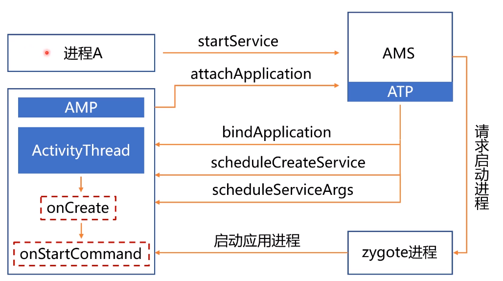
###### bindService的流程
+ 用向AMS发起bindService调用。
+ AMS首先检查有没有Service的binder句柄，如果有就直接把它回调给应用。
+ 如果没有，AMS就会向Service请求binder句柄。
+ Service收到之后就会把自己的binder句柄发布到AMS。
+ AMS再把这个binder句柄回调给应用。
+ 应用拿到这个binder句柄后就可以向Service发起binder调用了。
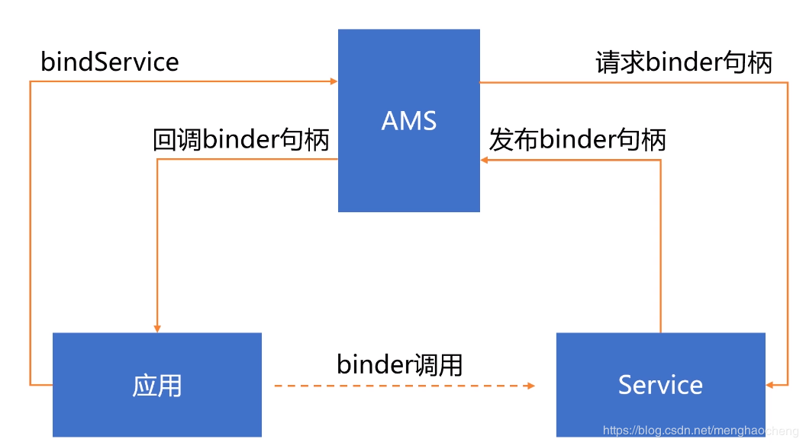

###### 参考资料 [《Service启动原理》](https://www.cnblogs.com/renhui/p/12964554.html)
##### 2 说说service的绑定原理

##### 3 说说动态广播的注册和收发原理

##### 4 说说静态广播的注册和收发原理

##### 5 说说Provider的启动原理

#### 第5章 UI体系相关问题

本章主要讲UI体系相关问题，包括UI刷新机制，涉及到vsync和choreographer原理。另外还会讲到surface的相关原理，涉及到应用和WMS、surfaceFlinger通信。
##### 1 说说屏幕刷新的机制-1

##### 2 说说屏幕刷新的机制-2

##### 3 surface跨进程传递原理

##### 4 surface的绘制原理

##### 5 你对vsync机制有了解吗？

##### 6 SurfaceView & View的区别，底层原理有何不同

#### 第6章 进程通信相关问题

本章主要讲进程通信相关问题，包括binder的整体架构和通信原理，oneway机制，binder对象的传递等等。
##### 1 Android Framework用到了哪些跨进程通信方式
跨进程通信主要有以下几类：管道、Socket、共享内存、信号。
+ 管道
管道的特点是半双工&单向的，管道里面的数据只能往一个方向流动。一般情况下管道是在父子进程之间使用的。

+ socket
socket的特点是全双工，即可读也可写。可以用在两个无亲缘关系的进程之间，但需要公开路径。
例子：在Android的Framework机制中，zygote就是通过socket来接受AMS的请求，然后启动应用进程的。

+ 共享内存
共享内存的特点：速度快，且不需要多次拷贝，且进程之间不需要存在亲缘关系，只需要拿到文件描述符即可。
这里补充一下：管道和socket的问题在于数据不能太大，否则性能会非常糟糕，相比较共享内存不存在这个问题。

+ 信号
信号的特点是：
  + a).单向的，发送出去后不管其他人接受者是如何处理的；
  + b).只能带信号，不能带其他参数。
  + c).知道进程的pid就可以发信号，而且一次可以一群进程发信号（需 root权限 或 同uid 才行）。
例子：Android的Process#killProcess方法，就是发送的 SIGNAL_KILL 信号。

+ Binder 
Binder机制是Android特有的进程间通信的机制，特点为：采用C/S的通信模式、有更好的传输性能，最重要的特点是安全。
Android的四大组件，有时候不同的组件之间所在的进程是不一样的，当处于不同的进程的时候，就需要进行进程间通信了。这些进程间的通信依赖于Binder IPC机制。不仅如此，Android 系统对应用层提供的服务如：AMS、PMS等都是基于Binder IPC机制实现的。Binder机制在Android系统中的位置非常重要。

##### 2 谈谈你对Binder的理解

##### 3 一次完整的ipc通信流程是怎样的
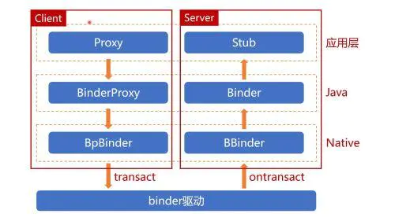
##### 4 binder对象跨进程传递原理是怎么样的
+ Binder 跨进程传输是通过 Parcel 传输的，先通过 WriteStrongBinder 写到 Parcel 再通过 ReadStrongBinder 读取Parcel。
+ 在 Parcel 中存储的结构是 flat_binder_object 根据偏移量来确定保存的位置。然后 Binder 驱动通过读取 Parcel 中的 binder 实体对象 创建了 binder_node 结构，和 binder_ref 引用给到目标进程；
+ 目标进程通过 binder_ref 的 handle 创建了 BpBinder 再往上调用到 BinderProxy 再调用到业务层 Proxy
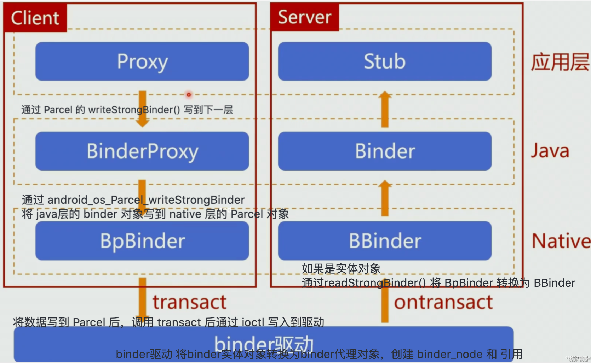

##### 5 说一说binder的oneway机制
+ 非 oneway：调用方阻塞（休眠）
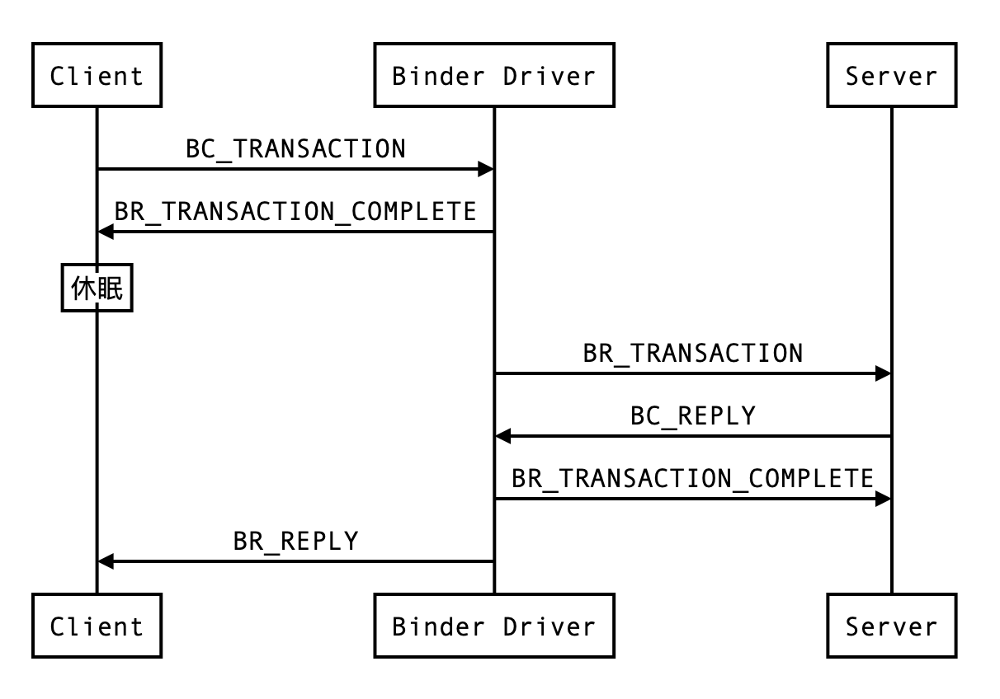


+ oneway：调用方非阻塞（non-block）
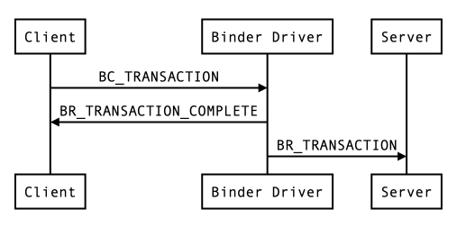

#### 第7章 线程通信相关问题

本章主要讲线程通信原理相关问题，包括消息队列的创建，消息循环机制，消息延时，同步和异步消息，消息屏障等等内容。
##### 1 线程的消息队列是怎么创建的？
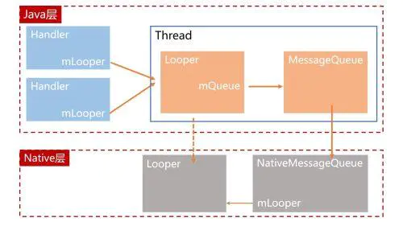

##### 2 说说android线程间消息传递机制
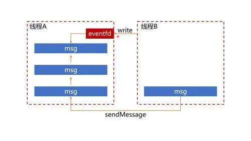

##### 3 handler的消息延时是怎么实现的？

##### 4 说说idleHandler的原理

##### 5 主线程进入loop循环了为什么没有ANR？

##### 6 听说过消息屏障么？

##### 7 多线程间通信和多进程之间通信有什么不同，分别怎么实现？

#### 第8章 技巧，心得相关

除了上面章节之外的所有问题，都会放在本章讲到，除了原理之外，还会分享一些代码技巧。
##### 1 怎么跨进程传递大图片

##### 2 说说threadLocal的原理

##### 3 来说说looper的副业

##### 4 怎么检查线程有耗时任务
##### 5 怎么同步处理消息
##### 6 主线程&ApplicationThread
